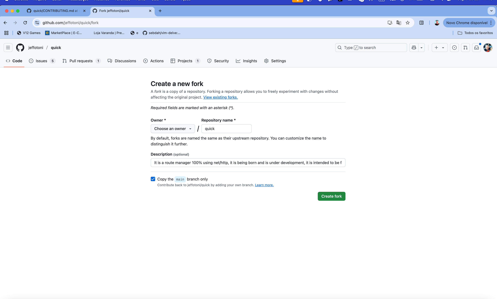
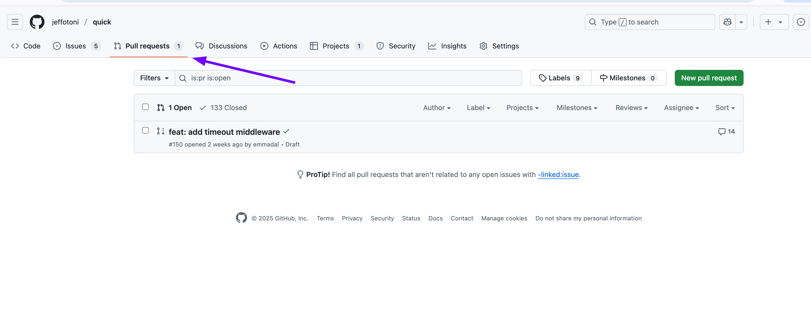
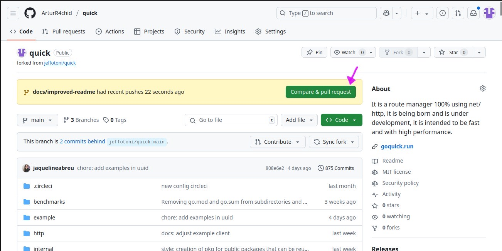
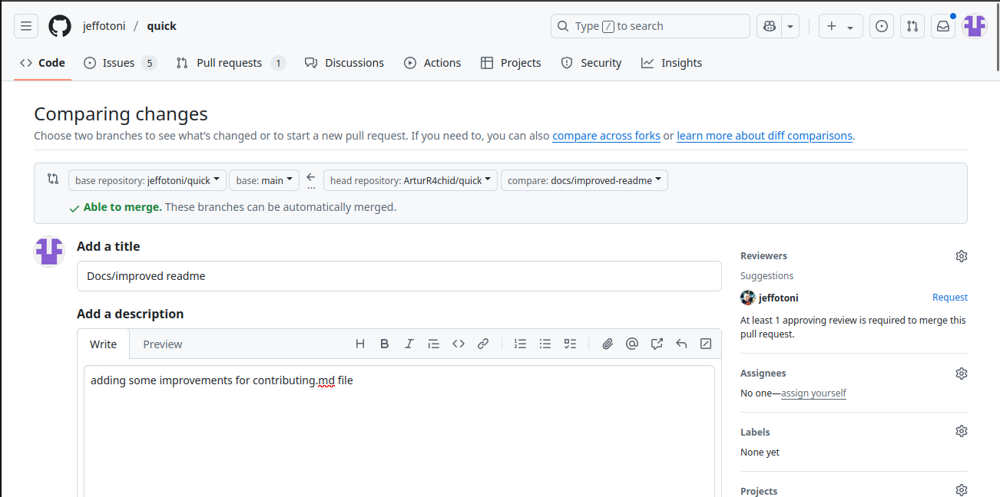

# 🤝 How to contribute to the Quick project

Thank you for considering contributing to **Quick** – a Go framework designed for **speed**, **simplicity**, and **productivity**.

**Any contribution is welcome!** Whether it’s code, documentation, examples, or suggestions — it all matters. 💚

---

## 🚀 How to contribute

### 🔧 1. Fork this repository

You can click the **"Fork"** button at the top of the repository page on GitHub.


---

### 🌱 2. Clone your fork locally

HTTPS
```bash
$ git clone https://github.com/YOUR_USER/quick.git
$ cd quick
```
SSH
```bash
$ git clone ssh://git@github.com/YOUR_USER/quick.git
$ cd quick
```

**Replace YOUR_USER with your GitHub username.**

## 🌿 3. Create a branch with a clear name and in the recommended pattern

Use the pattern:

```bash
$ git checkout -b feat/your-feature-name
```

Examples:

```bash
$ git checkout -b fix/fix-readme-url
$ git checkout -b docs/logger-example
```

## ✏️ 4. Make your changes, commit and push using the pattern

```bash
$ git add . 
$ git commit -am "feat: add timeout middleware"
$ git push origin feat/your-feature-name
```

## 🔁 5. Open a Pull Request

• Access your fork on GitHub
• Click “Compare & Pull Request”
• Submit the PR to the jeffotoni:main branch



## 🔄 6. (Optional) Keep your fork up to date

If you plan to collaborate on an ongoing basis, it's a good idea to keep your fork in sync with the main repository:

### ✅ Add the upstream remote

```bash
$ git remote add upstream https://github.com/jeffotoni/quick.git
```

### 🔄 Fetch updates from the official repository

```bash
$ git fetch upstream
```
**That's the way out, if it's not up to date**


```bash

$ git checkout main
$ git merge upstream/main
```
**If you are up to date that's will be the way out**


### ⬆️ Update your fork on GitHub with the new content

```bash
$ git push origin main
```

**thats will be the way out**


## 🌱 Branch name pattern

Always use the same pattern as the commit, adapted as a branch prefix:

| Prefix | Description | Example |
|---------------|----------------------------------------|------------------------------------|
| `feat/` | New feature | `feat/timeout-middleware` |
| `fix/` | Bug fix | `fix/logger-null-error` |
| `docs/` | Documentation | `docs/update-readme-links` |
| `style/` | Formatting adjustments | `style/format-comments` |
| `refactor/` | Refactoring without changing behavior | `refactor/logger-structure` |
| `test/` | Unit tests | `test/add-msguuid-test` |
| `chore/` | Internal tasks | `chore/update-dependencies` |

**📌 Example commits:**

    feat: add timeout middleware
    fix: correct panic when body is nil
    docs: improve README with example for logger
    test: add unit test for msguuid middleware
    refactor: simplify error handler logic

### 📌 Example branch creation:

```bash
$ git checkout -b feat/timeout-middleware
```
### ✅ 7. Create the Pull Request (in the browser)
follow step by step on the  instructions to create a pull request
 - First you go to your forked repository on GitHub;
 - Click on the Compare & pull request button (it appears after the push);
  
  
 
 - Check that the base is correct:
 ```bash
 Here is a example:
 base repository: jeffotoni/quick
 ```
 - base branch: usually main or the branch of the main project.
 ```bash
 - head repository: your-user/quick
 ```
 - compare: my-feature
 - Add a title and description explaining the change.

 

**- Click on Create pull request**


## 📦 What can you do?

**You can contribute in many ways — all are welcome:**
🐞 Fix links or typos
📚 Add or improve usage examples in examples/
💬 Comment functions in the code clearly
⚙️ Improve performance or internal structure
🧪 Write unit tests using QTest
✍️ Improve documentation

**💡 It doesn't matter how big your contribution is. The important thing is to contribute.**

## 🧪 What is mandatory in the code? 
✅ Always unit tests, check the examples in Quick
✅ Test coverage if possible 100% of what is being proposed
✅ Objective and direct comments about what the function does
✅ Clean, idiomatic code, and following good Go practices

## 💚 Support the project

**If you want to thank or support Quick, here are some simple ways to do so:**
• ⭐ Give a star to the repository here on [GitHub Quick](https://github.com/jeffotoni/quick)
• 📢 Share the project on your social networks
• ✍️ Write a post or tutorial on [Dev.to](https://dev.to) or on your personal blog
• ☕ Support with a cup of coffee: [patreon.com/go_quick](https://patreon.com/go_quick)

## 🗣️ Questions? Suggestions?

- Open an [issue](https://github.com/jeffotoni/quick/issues) or comment directly on a Pull Request.
- It will be a pleasure to help you contribute to the project.
- You can post in [discussions](https://github.com/jeffotoni/quick/discussions)

**Let's **godar** with purpose, community and lightness.**

**You are very welcome! 🚀 💚**