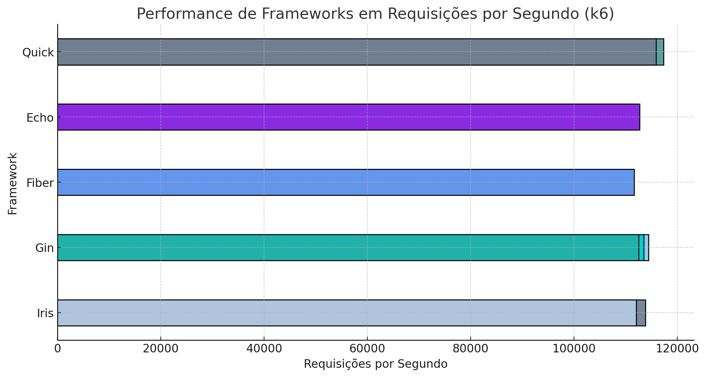
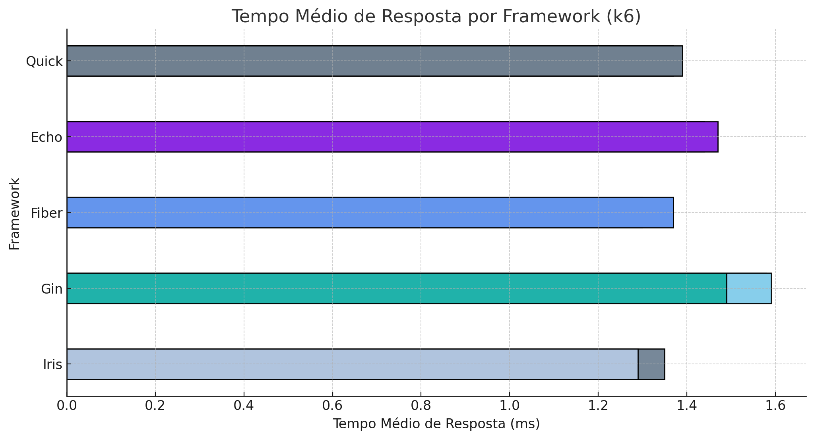

# 📌 Benchmarks Quick
📌 Benchmarks Quick

This repository provides a comprehensive benchmark comparison of various Go web frameworks, including **Quick**, Fiber, Echo, Iris, and Gin. Our goal is to evaluate their performance under high-load conditions, measuring request handling efficiency, response times, and resource utilization.

We conduct stress tests and real-world scenarios to determine how each framework scales and performs under different workloads. These benchmarks aim to provide valuable insights for developers choosing the most suitable framework for their needs.

Stay tuned for results, methodology, and detailed analysis! 🚀

---

## 🚀 Test Structure

- **Quick**
- **Gin**
- **Fiber**
- **Echo**
- **Iris**

```bash
 servers
    ├── echo
    │   └── post.simples
    │       ├── bind
    │       │   └── main.go
    │       └── byte
    │           └── main.go
    ├── fiber
    │   ├── go.mod
    │   ├── go.sum
    │   └── post.simples
    │       ├── bodyparser
    │       │   └── main.go
    │       └── byte
    │           └── main.go
    ├── gin
    │   ├── go.mod
    │   ├── go.sum
    │   └── post.simple
    │       ├── bind
    │       │   └── main.go
    │       ├── byte
    │       │   └── main.go
    │       ├── shouldBind
    │       │   └── main.go
    │       └── shouldBindBodyWithJSON
    │           └── main.go
    ├── iris
    │   ├── go.mod
    │   ├── go.sum
    │   └── post.simple
    │       ├── byte
    │       │   └── main.go
    │       └── readJSON
    │           └── main.go
    └── quick
        └── post.simple
            ├── bind
            │   └── main.go
            ├── bodyParser
            │   └── main.go
            └── byte
                └── main.go

### JSON Used in sending
```json
{
    "name": "jeffotoni",
    "year": 39
}
```

## 🚀 Table of Commands used to parse Body

```markdown
| Framework | Comando Utilizado para Parse |
|-----------|------------------------------------------------|
| Quick    | c.BodyParser, c.Bind, c.Body                    |
| Gin      | c.Bind, c.ShouldBind, c.ShouldBindWithJSON      |
| Fiber    | c.BodyParser, c.Bind                            |
| Echo     | c.Bind                                          |
| Iris     | ctx.ReadJSON,  ctx.GetBody                      |
```

### ▶️Command to run the tests

```sh
k6 run k6/post.js
```

## 📊 Graphics

The graphs below represent the main test results:

- **Number of Requests per Second**
  

- **Average Response Time**
  

## 📌k6 Results (Summary)

```markdown
| Framework | Teste                          | Método de Retorno            | Requisições/s    | Tempo Médio de Resposta | Taxa de Erro |
|-----------|--------------------------------|------------------------------|------------------|--------------------------|--------------|
| Quick    | post.simple.bind                 | c.Status(200).JSON(my)         | 117,302 req/s   | 1.37 ms                  | 0%           |
| Quick    | post.simple.bodyParser           | c.Status(200).JSON(my)         | 112,446 req/s   | 1.25 ms                  | 0%           |
| Quick    | post.simple.byte                 | c.Status(200).Send(data)       | 115,855 req/s   | 1.39 ms                  | 0%           |
| Echo     | post.simple.bind                 | c.JSON(http.StatusOK, my)      | 111,629 req/s   | 1.44 ms                  | 0%           |
| Echo     | post.simple.byte                 | c.JSON(http.StatusOK, my)      | 112,682 req/s   | 1.47 ms                  | 0%           |
| Fiber    | post.simple.bodyParser           | c.Status(200).JSON(my)         | 111,399 req/s   | 1.30 ms                  | 0%           |
| Fiber    | post.simple.byte                 | c.Send(rawBody)                | 111,624 req/s   | 1.37 ms                  | 0%           |
| Gin      | post.simple.bind                 | c.JSON(http.StatusOK, my)      | 111,442 req/s   | 1.58 ms                  | 0%           |
| Gin      | post.simple.byte                 | c.JSON(http.StatusOK, my)      | 114,425 req/s   | 1.59 ms                  | 0%           |
| Gin      | post.simple.shouldBind           | c.JSON(http.StatusOK, my)      | 113,500 req/s   | 1.47 ms                   | 0%           |
| Gin      | post.simple.shouldBindBodyWithJSON | c.JSON(http.StatusOK, my)     | 112,509 req/s   | 1.49 ms                  | 0%           |
| Iris     | post.simple.byte                 | ctx.Write(bodyBytes)           | 113,852 req/s   | 1.35 ms                   | 0%           |
| Iris     | post.simple.ReadJSON             | ctx.JSON(my)                   | 112,007 req/s   | 1.29 ms                  | 0%           |
```


📌 Final Considerations

This document is a living benchmark that will be continuously updated as new tests, optimizations, and real-world scenarios are introduced. Our goal is to provide reliable, transparent, and actionable insights into the performance of Go web frameworks, helping developers make informed decisions.

We strongly encourage community participation! If you find areas for improvement, have suggestions for additional tests, or want to share your own benchmark results, feel free to contribute. Open-source collaboration is what drives innovation, and your input is invaluable in refining these benchmarks.

💡 Questions, Suggestions & Ideas?

Whether you have a technical question, a new test case idea, or feedback on the methodology, we’d love to hear from you!

🔹 Contribute: Open an issue or submit a pull request.
🔹 Discuss: Join the conversation and share your insights.
🔹 Connect: Let’s work together to push Go web performance forward!

🚀 Thank you for your interest and participation! Hope you enjoy the benchmarks!

