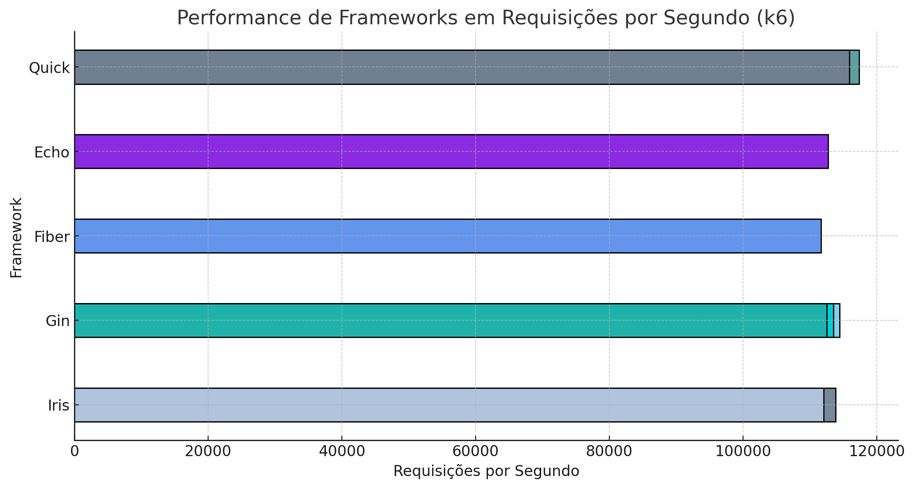
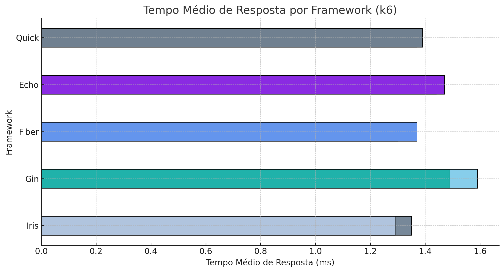
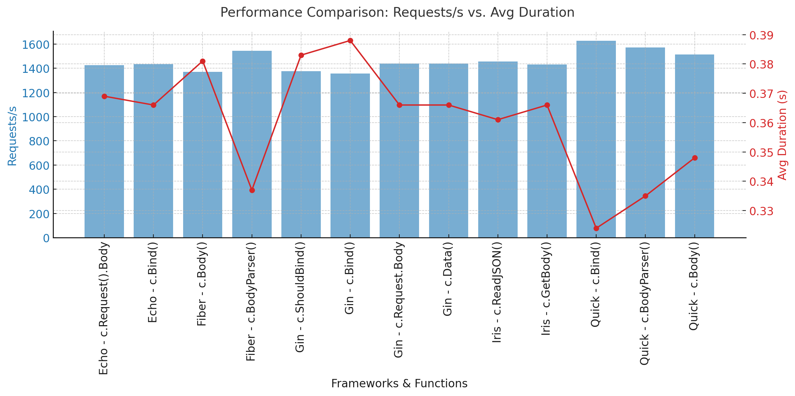
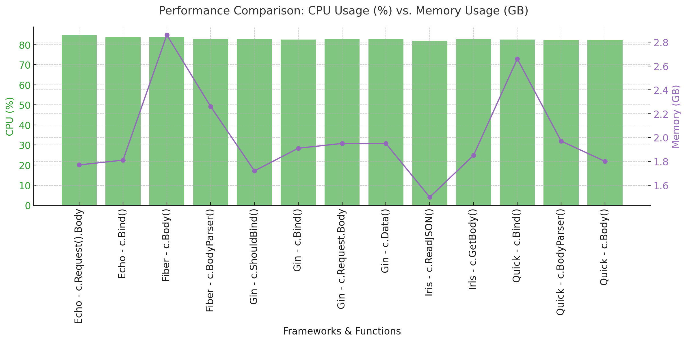

# 📌 Benchmarks Quick k6
📌 Benchmarks Quick

This repository provides a comprehensive benchmark comparison of various Go web frameworks, including **Quick**, Fiber, Echo, Iris, and Gin. Our goal is to evaluate their performance under high-load conditions, measuring request handling efficiency, response times, and resource utilization.

We conduct stress tests and real-world scenarios to determine how each framework scales and performs under different workloads. These benchmarks aim to provide valuable insights for developers choosing the most suitable framework for their needs.

Stay tuned for results, methodology, and detailed analysis! 🚀

---

## 🚀 Test Structure

- **Quick**
- **Gin**
- **Fiber**
- **Echo**
- **Iris**

```bash
 servers
    ├── echo
    │ └── post.simples
    │     ├── bind
    │     │ └── main.go
    │     └── byte
    │         └── main.go
    ├── fiber
    │ ├── go.mod
    │ ├── go.sum
    │ └── post.simples
    │     ├── bodyparser
    │     │ └── main.go
    │     └── byte
    │         └── main.go
    ├── gin
    │ ├── go.mod
    │ ├── go.sum
    │ └── post.simple
    │     ├── bind
    │     │ └── main.go
    │     ├── byte
    │     │ └── main.go
    │     ├── shouldBind
    │     │ └── main.go
    │     └── shouldBindBodyWithJSON
    │         └── main.go
    ├── iris
    │ ├── go.mod
    │ ├── go.sum
    │ └── post.simple
    │     ├── byte
    │     │ └── main.go
    │     └── readJSON
    │         └── main.go
    └── quick
        └── post.simple
            ├── bind
            │ └── main.go
            ├── bodyParser
            │ └── main.go
            └── byte
                └── main.go

### JSON Used in sending
```json
{
    "name": "jeffotoni",
    "year": 39
}
```

## 🚀 Table of Commands used to parse Body

```markdown
| Framework | Command used for parse  |
|-----------|------------------------------------------------|
| Quick    | c.BodyParser, c.Bind, c.Body                    |
| Gin      | c.Bind, c.ShouldBind, c.ShouldBindWithJSON      |
| Fiber    | c.BodyParser, c.Bind                            |
| Echo     | c.Bind                                          |
| Iris     | ctx.ReadJSON,  ctx.GetBody                      |
```

### ▶️Install k6


### ▶️Command to run the tests

```sh
k6 run k6/post.js
```

## 📊 Graphics

The graphs below represent the main test results:

- **Number of Requests per Second**
  

- **Average Response Time**
  

## 📌k6 Results (Summary) - 

Apple M3 16 physical CPU cores and 16 virtual cores

| Framework | Test         | Return Method          | Total HTTP Requests | Requests/s   | Avg Response Time | Data Received | Data Sent | Error Rate |
|-----------|-------------|------------------------|----------------------|--------------|-------------------|---------------|-----------|-----------|
| Quick     | post.simple | bind                   | 2,580,710            | 117,302.95   | 1.37ms            | 361MB         | 444MB     | 0.00%     |
| Quick     | post.simple | bodyParser             | 2,473,856            | 112,446.38   | 1.25ms            | 346MB         | 426MB     | 0.00%     |
| Quick     | post.simple | byte                   | 2,548,852            | 115,855.11   | 1.39ms            | 380MB         | 438MB     | 0.00%     |
| Echo      | post.simple | bind                   | 2,455,926            | 111,629.64   | 1.44ms            | 346MB         | 422MB     | 0.00%     |
| Echo      | post.simple | byte                   | 2,479,092            | 112,682.71   | 1.47ms            | 350MB         | 426MB     | 0.00%     |
| Fiber     | post.simple | bodyParser             | 2,450,836            | 111,399.87   | 1.30ms            | 346MB         | 422MB     | 0.00%     |
| Fiber     | post.simple | byte                   | 2,455,787            | 111,624.79   | 1.37ms            | 346MB         | 422MB     | 0.00%     |
| Gin       | post.simple | bind                   | 2,451,771            | 111,442.32   | 1.58ms            | 346MB         | 422MB     | 0.00%     |
| Gin       | post.simple | byte                   | 2,517,425            | 114,425.63   | 1.59ms            | 355MB         | 433MB     | 0.00%     |
| Gin       | post.simple | shouldBind             | 2,497,045            | 113,500.33   | 1.47ms            | 352MB         | 430MB     | 0.00%     |
| Gin       | post.simple | shouldBindWithJSON     | 2,475,239            | 112,509.01   | 1.49ms            | 349MB         | 426MB     | 0.00%     |
| IRIS      | post.simple | byte                   | 2,504,791            | 113,852.23   | 1.35ms            | 388MB         | 431MB     | 0.00%     |
| IRIS      | post.simple | ReadJSON               | 2,464,202            | 112,007.25   | 1.29ms            | 384MB         | 424MB     | 0.00%     |


--- 

### K6 Benchmark Comparison 487Kb, 35000 lines use []struct - list

A list [{}] in JSON is being sent with the POST method and it is 487kb in size.
We tested the Quick, Echo, Fiber, Gin and Iris frameworks, and all of them had the same or corresponding functions.

**Apple M3 16 physical CPU cores and 16 virtual cores**

| Framework | Function          | Requests/s  | Avg Duration (s) | CPU (%)  | Memory (GB)  |
|-----------|------------------|-------------|------------------|---------|-------------|
| Quick     | c.Bind()          | 1625.90 ✅  | 0.324 ✅         | 82.50 ✅ | 2.66        |
| Quick     | c.BodyParser()    | 1572.24     | 0.335            | 82.20   | 1.97        |
| Quick     | c.Body()          | 1513.69     | 0.348            | 82.20   | 1.80        |
| Echo      | c.Request().Body  | 1425.05     | 0.369            | 84.65 ❌ | 1.77        |
| Echo      | c.Bind()          | 1433.59     | 0.366            | 83.76   | 1.81        |
| Fiber     | c.Body()          | 1371.05 ❌  | 0.381            | 83.90   | 2.86 ❌      |
| Fiber     | c.BodyParser()    | 1544.03     | 0.337            | 82.80   | 2.26        |
| Gin       | c.ShouldBind()    | 1374.53     | 0.383 ❌         | 82.70   | 1.72 ✅      |
| Gin       | c.Bind()          | 1355.15 ❌  | 0.388 ❌         | 82.50 ✅ | 1.91        |
| Gin       | c.Request.Body    | 1440.02     | 0.366            | 82.70   | 1.95        |
| Iris      | c.ReadJSON()      | 1457.08     | 0.361            | 82.00 ✅ | 1.50 ✅      |
| Iris      | c.GetBody()       | 1430.75     | 0.366            | 82.90   | 1.85        |


| Metric                | Best Framework / Function         | Worst Framework / Function        |
|-----------------------|---------------------------------|----------------------------------|
| **Highest Requests/s** | ✅ **Quick - c.Bind() (1625.90/s)** | ❌ Gin - c.Bind() (1355.15/s)       |
| **Lowest Avg Duration** | ✅ **Quick - c.Bind() (0.324s)**   | ❌ Gin - c.Bind() (0.388s)          |
| **Lowest CPU Usage**    | ✅ **Iris - c.ReadJSON() (82.00%)** | ❌ Echo - c.Request().Body (84.65%) |
| **Lowest Memory Usage** | ✅ **Iris - c.ReadJSON() (1.50GB)** | ❌ Fiber - c.Body() (2.86GB)        |


## 📊 Graphics

Here is the bar and line chart comparing Requests/s and Avg Duration (s) for each framework and function tested. 🚀

The graphs below represent the main test results:

- **Number of Requests per Second and Avg Duration (s)**
  

- **CPU Usage (%) and Memory Usage (GB)**
  


    Key Takeaways
    •   ✅ Quick performed best overall, with the highest requests per second (1625.90/s) and lowest average duration (0.324s).
    •   ✅ Iris was the most efficient in resource consumption, using only 1.50GB of memory for c.ReadJSON(), while Fiber consumed the most (2.86GB).
    •   ❌ Echo had the highest CPU consumption at 84.65%, whereas Iris had the lowest (82.00%).
    •   ❌ Gin performed the worst in multiple metrics, especially with c.Bind(), which had a low request rate and higher response time.

    Final Verdict:
    •   🚀 Quick is the best overall framework for high performance.
    •   ⚡ Iris is the most efficient in CPU & memory usage.
    •   ⚖️ Fiber & Echo had intermediate results.
    •   ❌ Gin struggled in multiple areas, making it the weakest option.


----

### 📌 Final Considerations
This document is a living benchmark that will be continuously updated as new tests, optimizations, and real-world scenarios are introduced. Our goal is to provide reliable, transparent, and actionable insights into the performance of Go web frameworks, helping developers make informed decisions.
We strongly encourage community participation! If you find areas for improvement, have suggestions for additional tests, or want to share your own benchmark results, feel free to contribute. Open-source collaboration is what drives innovation, and your input is invaluable in refining these benchmarks.

### 💡 Questions, Suggestions & Ideas?
Whether you have a technical question, a new test case idea, or feedback on the methodology, we’d love to hear from you!

🔹 Contribute: Open an issue or submit a pull request.
🔹 Discuss: Join the conversation and share your insights.
🔹 Connect: Let’s work together to push Go web performance forward!

#### 🚀 Thank you for your interest and participation! Hope you enjoy the benchmarks!
