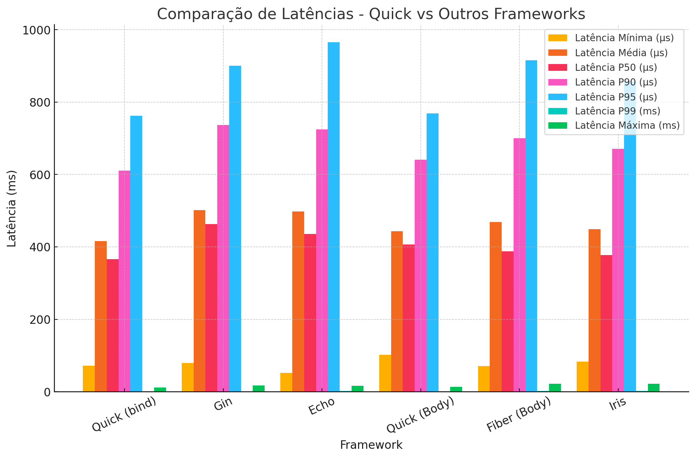

# 📌 Benchmarks Quick Vegeta
📌 Benchmarks Quick

This repository provides a comprehensive benchmark comparison of various Go web frameworks, including **Quick**, Fiber, Echo, Iris, and Gin. Our goal is to evaluate their performance under high-load conditions, measuring request handling efficiency, response times, and resource utilization.
We conduct stress tests and real-world scenarios to determine how each framework scales and performs under different workloads. These benchmarks aim to provide valuable insights for developers choosing the most suitable framework for their needs.
Stay tuned for results, methodology, and detailed analysis! 🚀

---

## 🚀 Test Structure

- **Quick**
- **Gin**
- **Fiber**
- **Echo**
- **Iris**

```json
{
    "name": "jeffotoni",
    "year": 39
}
```

## 🚀 Table of Commands used to parse Body

```markdown
| Framework | Comando Utilizado para Parse |
|-----------|------------------------------------------------|
| Quick    | c.BodyParser, c.Bind, c.Body                    |
| Gin      | c.Bind, c.ShouldBind, c.ShouldBindWithJSON      |
| Fiber    | c.BodyParser, c.Bind                            |
| Echo     | c.Bind                                          |
| Iris     | ctx.ReadJSON,  ctx.GetBody                      |
```

### ▶️ Install Vegeta
**Linux**
```sh
$ curl -LO https://github.com/tsenart/vegeta/releases/latest/download/vegeta-linux-amd64 && \
chmod +x vegeta-linux-amd64 && \
sudo mv vegeta-linux-amd64 /usr/local/bin/vegeta
```

```sh
$ vegeta -version
```

**Mac (via Homebrew)**
```sh
$ brew install vegeta
```

```sh
$ vegeta -version
```

### ▶️Command to run the tests

```sh
$ vegeta attack -duration=22s -rate=500 -max-workers=1000 -targets=targets.txt | tee results.bin | vegeta report

• cat payload.json → Reads the contents of the JSON file.
• vegeta attack → Starts the payload attack.
• -duration=22s → Tests for 22 seconds.
• -rate=500 → Makes 500 requests per second.
• -max-workers=1000 → Uses up to 1000 simultaneous workers.
• vegeta report → Generates a statistical report of the test.

```

## 📊 Graphics
```sh
$ cat results.bin | vegeta plot > plot.html && open plot.html
```

The graphs below represent the main test results:

- **latency comparison**
  

## 📌 Quick vs Gin Comparison
### Post using `bind()`

## 🔥 Performance Comparison
| Metric        | Quick  | Gin  | Difference |
|--------------|--------|------|------------|
| **Total Requests** | 11,000 | 11,000 | Same |
| **Requests per second (req/s)** | 500.04 | 500.03 | Almost same |
| **Total Duration** | 21.998s | 21.999s | Almost same |
| **Average Wait Time** | 368.875µs | 656.708µs | **Quick is ~43.8% faster** |
| **Min Latency** | 72.042µs | 79.458µs | Quick is faster |
| **Mean Latency** | 415.78µs | 501.271µs | **Quick is ~17% faster** |
| **P50 Latency (median)** | 365.956µs | 462.721µs | **Quick is faster** |
| **P90 Latency** | 610.803µs | 737.037µs | Quick is faster |
| **P95 Latency** | 761.875µs | 900.326µs | Quick is faster |
| **P99 Latency** | 1.49ms | 1.665ms | Quick is faster |
| **Max Latency** | 11.906ms | 17.668ms | Quick is faster |
| **Bytes In** | 330,000 | 330,000 | Same |
| **Bytes Out** | 484,000 | 484,000 | Same |
| **Success Rate (%)** | 100% | 100% | Same |

## 📊 Conclusion

1. **Quick outperforms Gin in all latency metrics** (mean, P50, P90, P95, P99, and max).
2. **Quick's average wait time is ~43.8% lower**, making it more efficient in handling requests.
3. **Both frameworks maintain the same throughput (500 req/s)** with **100% success rate**, meaning no failed requests.
4. **Quick has lower max latency (11.906ms vs 17.668ms in Gin)**, indicating better stability under load.


## Quick vs Echo Comparison
### Post using `bind()`

## 🔥 Performance Comparison
| Metric        | Quick  | Echo  | Difference |
|--------------|--------|------|------------|
| **Total Requests** | 11,000 | 11,000 | Same |
| **Requests per second (req/s)** | 500.04 | 500.03 | Almost same |
| **Total Duration** | 21.998s | 21.999s | Almost same |
| **Average Wait Time** | 368.875µs | 640.083µs | **Quick is ~42.3% faster** |
| **Min Latency** | 72.042µs | 52µs | Echo is faster |
| **Mean Latency** | 415.78µs | 498.178µs | **Quick is ~16.5% faster** |
| **P50 Latency (median)** | 365.956µs | 436.115µs | **Quick is faster** |
| **P90 Latency** | 610.803µs | 724.694µs | Quick is faster |
| **P95 Latency** | 761.875µs | 965.72µs | Quick is faster |
| **P99 Latency** | 1.49ms | 1.887ms | Quick is faster |
| **Max Latency** | 11.906ms | 16.273ms | Quick is faster |
| **Bytes In** | 330,000 | 341,000 | Echo processes 3.3% more |
| **Bytes Out** | 484,000 | 484,000 | Same |
| **Success Rate (%)** | 100% | 100% | Same |

## 📊 Conclusion

1. **Quick outperforms Echo in most latency metrics** (mean, P50, P90, P95, P99, and max).
2. **Quick’s average wait time is ~42.3% lower**, indicating it handles requests more efficiently.
3. **Echo has a slightly better minimum latency (52µs vs. 72.042µs in Quick)** but higher average and max latency.
4. **Both frameworks maintain the same throughput (500 req/s)** with **100% success rate**.
5. **Echo processes slightly more incoming data (31 bytes per request vs. 30 in Quick)**.

## Quick vs Fiber Comparison
### Function used: `c.BodyParser(&my)`

## 🔥 Performance Comparison

| Metric        | Quick  | Fiber  | Difference |
|--------------|--------|--------|------------|
| **Total Requests** | 11,000 | 11,000 | Same |
| **Requests per second (req/s)** | 500.05 | 500.04 | Almost same |
| **Total Duration** | 21.998s | 21.998s | Same |
| **Average Wait Time** | 215.666µs | 324.125µs | **Quick is ~33.5% faster** |
| **Min Latency** | 88.375µs | 65.208µs | **Fiber is faster** |
| **Mean Latency** | 473.363µs | 368.739µs | **Fiber is ~22% faster** |
| **P50 Latency (median)** | 450.511µs | 331.394µs | **Fiber is faster** |
| **P90 Latency** | 692.284µs | 572.707µs | Fiber is faster |
| **P95 Latency** | 836.958µs | 712.555µs | Fiber is faster |
| **P99 Latency** | 1.396ms | 1.348ms | Fiber is faster |
| **Max Latency** | 18.985ms | 12.919ms | **Fiber is more stable** |
| **Bytes In** | 330,000 | 330,000 | Same |
| **Bytes Out** | 484,000 | 484,000 | Same |
| **Success Rate (%)** | 100% | 100% | Same |

---

## 📊 Conclusion

1. **Fiber outperforms Quick in most latency metrics**, with lower mean, P50, P90, P95, and P99 latencies.
2. **Quick has a 33.5% lower average wait time**, meaning it processes requests faster before responding.
3. **Fiber has a better min latency (65.208µs vs. 88.375µs in Quick)** and handles most requests with lower response times.
4. **Quick shows higher maximum latency (18.985ms vs. 12.919ms in Fiber)**, meaning Fiber is more stable under load.
5. **Both frameworks maintain the same throughput (500 req/s)** and **100% success rate**, meaning no failed requests.

🚀 **Fiber has a slight edge in handling JSON body parsing efficiently, but Quick's lower wait time might still be an advantage in high-throughput applications.**

## Quick vs Fiber Comparison
### Function used: `c.Body()`

## 🔥 Performance Comparison

| Metric        | Quick  | Fiber  | Difference |
|--------------|--------|--------|------------|
| **Total Requests** | 11,000 | 11,000 | Same |
| **Requests per second (req/s)** | 500.05 | 500.04 | Almost same |
| **Total Duration** | 21.998s | 21.999s | Almost same |
| **Average Wait Time** | 296.625µs | 390.125µs | **Quick is ~23.9% faster** |
| **Min Latency** | 102.25µs | 71.042µs | **Fiber is faster** |
| **Mean Latency** | 443.084µs | 468.807µs | **Quick is ~5.5% faster** |
| **P50 Latency (median)** | 406.857µs | 387.458µs | **Fiber is slightly faster** |
| **P90 Latency** | 640.813µs | 700.019µs | **Quick is faster** |
| **P95 Latency** | 769.009µs | 915.951µs | **Quick is ~16% faster** |
| **P99 Latency** | 1.264ms | 2.37ms | **Quick is significantly more stable** |
| **Max Latency** | 13.354ms | 21.926ms | **Quick is more stable under peak loads** |
| **Bytes In** | 484,000 | 484,000 | Same |
| **Bytes Out** | 484,000 | 484,000 | Same |
| **Success Rate (%)** | 100% | 100% | Same |

---

## 📊 Conclusion

1. **Quick has a lower average wait time (296.625µs vs. 390.125µs in Fiber)**, meaning it responds more quickly overall.
2. **Fiber has a better minimum latency (71.042µs vs. 102.25µs in Quick)**, indicating slightly faster response in best-case scenarios.
3. **Quick has lower high-percentile latencies (P90, P95, P99), showing better stability under load**.
4. **Quick has a significantly lower maximum latency (13.354ms vs. 21.926ms in Fiber)**, making it more predictable at peak loads.
5. **Both frameworks maintain the same throughput (500 req/s)** and **100% success rate**, meaning no failed requests.

🚀 **Quick is more stable under heavy load, while Fiber offers slightly better response times in lower latency cases.**

## Quick vs Iris Comparison
### Function used:
- **Iris**: `ctx.GetBody()`
- **Quick**: `c.Body()`

## 🔥 Performance Comparison
| Metric        | Quick  | Iris  | Difference |
|--------------|--------|-------|------------|
| **Total Requests** | 11,000 | 11,000 | Same |
| **Requests per second (req/s)** | 500.04 | 500.05 | Almost same |
| **Total Duration** | 21.999s | 21.999s | Same |
| **Average Wait Time** | 562.375µs | 532.291µs | **Iris is ~5.3% faster** |
| **Min Latency** | 73.083µs | 82.667µs | **Quick is faster** |
| **Mean Latency** | 461.874µs | 449.265µs | **Iris is ~2.7% faster** |
| **P50 Latency (median)** | 432.788µs | 377.28µs | **Iris is faster** |
| **P90 Latency** | 667.976µs | 671.349µs | Almost the same |
| **P95 Latency** | 799.616µs | 857.188µs | **Quick is faster** |
| **P99 Latency** | 1.475ms | 2.004ms | **Quick is more stable** |
| **Max Latency** | 9.447ms | 22.352ms | **Quick is significantly more stable** |
| **Bytes In** | 484,000 | 484,000 | Same |
| **Bytes Out** | 484,000 | 484,000 | Same |
| **Success Rate (%)** | 100% | 100% | Same |

--

## 📊 Conclusion

1. **Quick shows lower max latency (9.447ms vs. 22.352ms in Iris)**, meaning it handles peak loads more consistently.
2. **Iris has a slightly lower mean latency (449.265µs vs. 461.874µs in Quick)** but the difference is minor (~2.7%).
3. **Iris is more responsive in the P50 range**, suggesting slightly faster average request handling.
4. **Quick is more stable at higher loads**, as seen in lower P95, P99, and max latency values.
5. **Both frameworks maintain the same throughput (500 req/s)** and **100% success rate**, meaning no failed requests.


🚀 **Quick proves to be a high-performance alternative to Gin for handling HTTP requests efficiently.**

### 📌 Final Considerations
This document is a living benchmark that will be continuously updated as new tests, optimizations, and real-world scenarios are introduced. Our goal is to provide reliable, transparent, and actionable insights into the performance of Go web frameworks, helping developers make informed decisions.
We strongly encourage community participation! If you find areas for improvement, have suggestions for additional tests, or want to share your own benchmark results, feel free to contribute. Open-source collaboration is what drives innovation, and your input is invaluable in refining these benchmarks.

### 💡 Questions, Suggestions & Ideas?
Whether you have a technical question, a new test case idea, or feedback on the methodology, we’d love to hear from you!

🔹 Contribute: Open an issue or submit a pull request.
🔹 Discuss: Join the conversation and share your insights.
🔹 Connect: Let’s work together to push Go web performance forward!

#### 🚀 Thank you for your interest and participation! Hope you enjoy the benchmarks!
