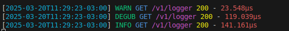
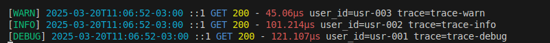
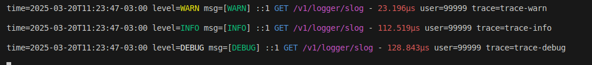

## 📜 Logger Middleware - Quick Framework

The **`Logger Middleware`** provides automatic logging of incoming HTTP requests in the Quick Framework. It helps developers track API requests, response times, and request details in a structured way.

---

#### ✅ Key Features

| Feature                  | Benefit                                                             |
| ------------------------ | ------------------------------------------------------------------- |
| 📄 **Request Logging**   | Automatically logs incoming requests with method, path, and status. |
| ⏳ **Execution Time**    | Captures the duration of each request.                              |
| 📊 **Debugging**         | Helps identify slow or failing requests.                            |
| 📜 **Structured Output** | Logs information in an easy-to-read format.                         |

---

#### 🚀 How It Works

When enabled, the Logger middleware captures and prints each request's details, including:

- **HTTP Method** (GET, POST, PUT, DELETE)
- **Request Path**
- **Status Code**
- **Response Time**

It helps in debugging and analyzing API performance.

---


#### 📝 Default Logging 
This example applies simple logging.

```go
package main

import (
	"github.com/jeffotoni/quick"
	"github.com/jeffotoni/quick/middleware/logger"
)

func main() {

	q := quick.New()
	q.Use(logger.New())

	q.Use(logger.New(logger.Config{
		Level: "DEGUB",
	}))

	q.Use(logger.New(logger.Config{
		Level: "WARN",
	}))

	q.Get("/v1/logger", func(c *quick.Ctx) error {
		c.Set("Content-Type", "application/json")

		return c.Status(200).JSON(quick.M{
			"msg": "Quick ❤️",
		})
	})

	q.Listen("0.0.0.0:8080")
}
```

### 📌 cURL 

Text Logging
```bash
$ curl -i -XGET http://localhost:8080/v1/logger
```
#### Console:


---

#### 📝 Structured Logging(Text Format)
This example applies logging in text format with custom log fields.

```go
package main

import (
	"github.com/jeffotoni/quick"
	"github.com/jeffotoni/quick/middleware/logger"
)

func main() {

	q := quick.New()

	q.Use(logger.New(logger.Config{
		Format:  "text",
		Pattern: "[${level}] ${time} ${ip} ${method} ${status} - ${latency} user_id=${user_id} trace=${trace}\n",
		Level:   "DEBUG",
		CustomFields: map[string]string{
			"user_id": "usr-001",
			"trace":   "trace-debug",
		},
	}))

	q.Use(logger.New(logger.Config{
		Format:  "text",
		Pattern: "[${level}] ${time} ${ip} ${method} ${status} - ${latency} user_id=${user_id} trace=${trace}\n",
		Level:   "INFO",
		CustomFields: map[string]string{
			"user_id": "usr-002",
			"trace":   "trace-info",
		},
	}))

	q.Use(logger.New(logger.Config{
		Format:  "text",
		Pattern: "[${level}] ${time} ${ip} ${method} ${status} - ${latency} user_id=${user_id} trace=${trace}\n",
		Level:   "WARN",
		CustomFields: map[string]string{
			"user_id": "usr-003",
			"trace":   "trace-warn",
		},
	}))

	// Definir rota GET para gerar logs
	q.Get("/v1/logger", func(c *quick.Ctx) error {
		c.Set("Content-Type", "application/json")

		// Retornar resposta JSON
		return c.Status(200).JSON(quick.M{
			"msg": "Quick ❤️",
		})
	})

	// Iniciar o servidor na porta 8080
	q.Listen("0.0.0.0:8080")
}

```
### 📌 cURL 

Text Logging
```bash
$ curl -i -XGET http://localhost:8080/v1/logger
```
#### Console:


---
### 🛠️ Structured Logging (Slog Format)

This example uses structured logging (slog) for better log parsing.

```go
package main

import (
	"github.com/jeffotoni/quick"
	"github.com/jeffotoni/quick/middleware/logger"
)


func main() {

	q := quick.New()

	// Apply the logger middleware with structured logging (slog)
	q.Use(logger.New(logger.Config{
		Format: "slog",
		Level:  "DEBUG",
		Pattern: "[${level}] ${ip} ${method} ${path} - ${latency} " +
			"user=${user_id} trace=${trace}\n",
		CustomFields: map[string]string{
			"user_id": "99999",
			"trace":   "trace-debug",
		},
	}))

	// Apply the logger middleware with structured logging (slog)
	q.Use(logger.New(logger.Config{
		Format: "slog",
		Level:  "INFO",
		Pattern: "[${level}] ${ip} ${method} ${path} - ${latency} " +
			"user=${user_id} trace=${trace}\n",
		CustomFields: map[string]string{
			"user_id": "99999",
			"trace":   "trace-info",
		},
	}))

	// Apply the logger middleware with structured logging (slog)
	q.Use(logger.New(logger.Config{
		Format: "slog",
		Level:  "WARN",
		Pattern: "[${level}] ${ip} ${method} ${path} - ${latency} " +
			"user=${user_id} trace=${trace}\n",
		CustomFields: map[string]string{
			"user_id": "99999",
			"trace":   "trace-warn",
		},
	}))

	// Define a test route
	q.Get("/v1/logger/slog", func(c *quick.Ctx) error {
		c.Set("Content-Type", "application/json")

		return c.Status(200).JSON(quick.M{
			"msg": "Structured logging with slog",
		})
	})

	// Start the server
	q.Listen("0.0.0.0:8080")
}

```
### 📌 cURL 

 Structured Logging (Slog)
```bash
$ curl -i -XGET http://localhost:8080/v1/logger/slog
```
#### Console:


---
### 📦 JSON Logging (Machine-Readable)

Ideal for log aggregation systems, this example logs in JSON format.

```go
package main

import (
	"github.com/jeffotoni/quick"
	"github.com/jeffotoni/quick/middleware/logger"
)

func main() {

	q := quick.New()

	// Apply logger with JSON format
	q.Use(logger.New(logger.Config{
		Format: "json",
		Level:  "INFO",
	}))

	q.Use(logger.New(logger.Config{
		Format:  "json",
		Pattern: "[${level}] ${time} ${ip} ${method} ${status} - ${latency} user_id=${user_id} trace=${trace}\n",
		Level:   "DEBUG",
		CustomFields: map[string]string{
			"user_id": "usr-001",
			"trace":   "trace-debug",
		},
	}))

	// Apply the logger middleware with structured logging (slog)
	q.Use(logger.New(logger.Config{
		Format: "json",
		Level:  "WARN",
		Pattern: "[${level}] ${ip} ${method} ${path} - ${latency} " +
			"user=${user_id} trace=${trace}\n",
		CustomFields: map[string]string{
			"user_id": "usr-001",
			"trace":   "trace-warn",
		},
	}))

	// Define an endpoint that triggers logging
	q.Get("/v1/logger/json", func(c *quick.Ctx) error {
		c.Set("Content-Type", "application/json")

		return c.Status(200).JSON(quick.M{
			"msg": "JSON logging example",
		})
	})

	// Start the server
	q.Listen("0.0.0.0:8080")
}
```
### 📌 cURL 

JSON Logging
```bash
$ curl -i -XGET http://localhost:8080/v1/logger/json
```
#### Console:


---
#### 📌 What I included in this README
- ✅ Overview: Explanation of what Logger Middleware does and its benefits.
- ✅ Key Features: Table highlighting request logging, execution time, debugging, and structured output.
- ✅ How It Works: Breakdown of logged request details (method, path, status, response time).
- ✅ Code Example: Implementation of Logger Middleware with a test route (/v1/logger).
- ✅ Testing with cURL: Example cURL request to verify logs in the terminal.
- ✅ Expected Output.

---


Now you can **complete with your specific examples** where I left the spaces 
.

🚀 **If you need adjustments or improvements, just let me know!** 😃🔥
