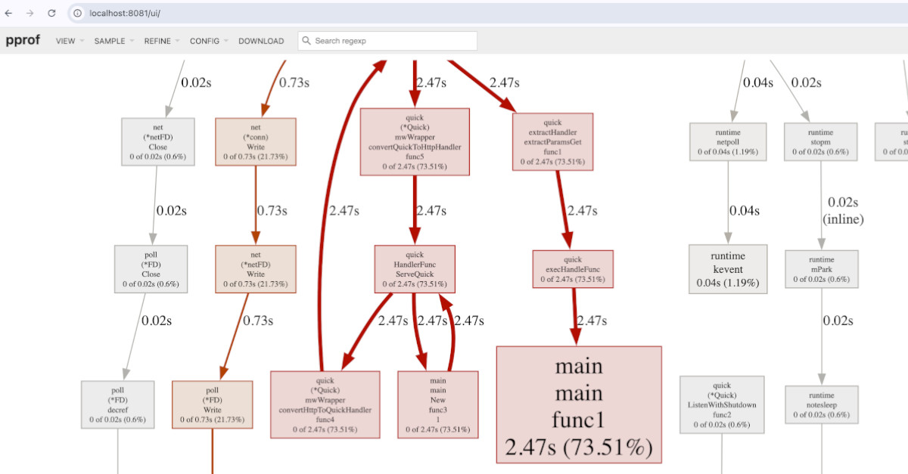

## 🧠 PPROF Middleware in Quick 

**pprof** provides profiling endpoints for your Quick application. It helps you to identify 
performance bottlenecks, monitor resource usage, and ensure that the code runs efficiently

---
### 🔻 Environment
Profiling is only enabled in development mode (APP_ENV=development). 

We strongly recommend to use it only in development mode because in production it can introduce
unwanted overhead and potentially degrade performance.

---
### 🧩 Example Usage
```go
package main

import (
	"errors"

	"github.com/jeffotoni/quick"
	"github.com/jeffotoni/quick/middleware/pprof"
)

func main() {
	q := quick.New()

	// Apply the Profiling middleware
	q.Use(pprof.New())

	// Define a test route
	q.Get("/", func(c *quick.Ctx) error {
		c.Set("Content-Type", "text/plain")
		return c.Status(quick.StatusOK).String("OK")
	})

	// Start the server
	q.Listen("0.0.0.0:8080")
}
```

---
### Routes

Profiling middleware registers a set of routes for profiling:

- `/debug/pprof`
- `/debug/cmdline`
- `/debug/profile`
- `/debug/symbol`
- `/debug/pprof/trace`
- `/debug/goroutine`
- `/debug/heap`
- `/debug/threadcreate`
- `/debug/mutex`
- `/debug/allocs`
- `/debug/block`

---

### Let's test our pprof

So that we can view the graphical form of our pprof in the browser, we will install the package graphviz.

For Mac
```bash
$ brew install graphviz
```

For Linux
```bash
$ apt install graphviz
```

```go

package main

import (
	"github.com/jeffotoni/quick"
	"github.com/jeffotoni/quick/middleware/pprof"
)

func main() {
	q := quick.New()

	q.Use(pprof.New())

	q.Get("/busy", func(c *quick.Ctx) error {
		// Simulates a load
		sum := 0
		for i := 0; i < 1e7; i++ {
			sum += i
		}
		return c.String("done")
	})

	// Mandatory route for pprof to work correctly
	q.Get("/debug/pprof*", func(c *quick.Ctx) error {
		return c.Next()
	})

	q.Listen("0.0.0.0:8080")
}

```

```bash
$ go run main.go
```

Let's generate a small load in our API
```bash
$ while true; do curl -s http://localhost:8080/busy > /dev/null; done
```


### Check if pprof is active

In Browser
```browser
http://localhost:8080/debug/pprof/
```

You will see the list:
	•	allocs
	•	block
	•	cmdline
	•	goroutine
	•	heap
	•	mutex
	•	profile
	•	threadcreate
	•	trace

### Generate the CPU profile with go tool pprof

```go
$ go tool pprof -http=:8081 http://localhost:8080/debug/pprof/profile?seconds=10
```

# 
