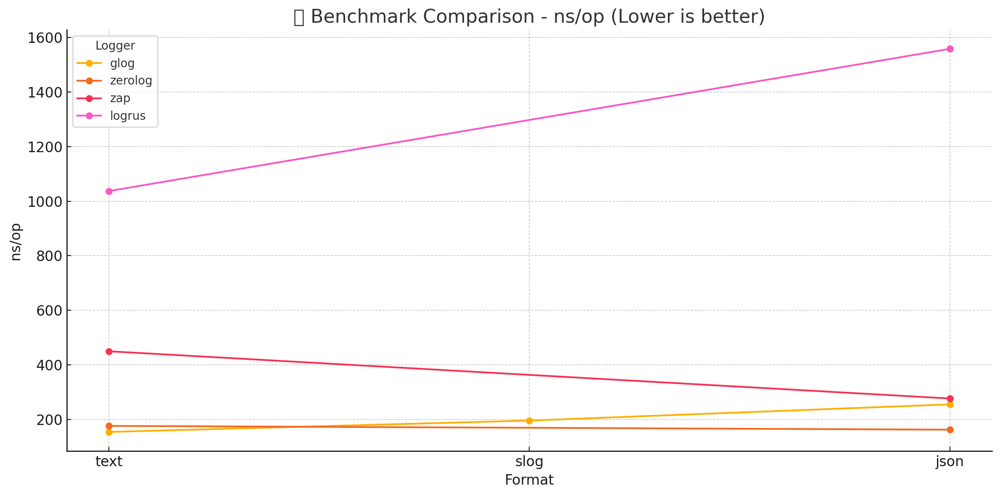

# 🌟 glog — Fast, Flexible, Beautiful Logging for Go 

`glog` is a lightweight and powerful logging library for Go designed for simplicity, flexibility, and readability — built for humans and structured for machines.

Part of the [Quick Framework](https://github.com/jeffotoni/quick) ecosystem, `glog` supports colorized terminal output, `slog`-style key=value logs, JSON format, dynamic fields, custom patterns, and intelligent defaults.

---

## ✨ Features

- 🔥 Lightweight and zero-dependency
- 🎨 Supports `text`, `slog`, and `json` formats
- 🧠 Dynamic separator detection (` | `, `--`, `:`… based on your pattern)
- 📋 Fluent log builder API with dynamic fields: `.Str()`, `.Int()`, `.Bool()`, `.Any()`, `.Msg()`
- 🎯 Built-in caller tracing: add `file:line` with `.Caller()`
- 🧵 Global `CustomFields` + per-log `Fields` (contextual)
- 🎯 Precise caller tracing with `${file}` (file:line) support
- 🎛️ Built-in log levels: `DEBUG`, `INFO`, `WARN`, `ERROR`
- 🧪 Fully tested with 100% coverage of critical paths
- 🌈 Terminal colors for `level` field (in `text` and `slog`)
- 🧠 Built-in fluent context support: create and extract TraceID, X-User-ID, etc
- ✅ Simple API: `Info()`, `Debugf()`, `Error()`, etc.

---

## 🚀 Benchmark Comparison

Hardware: Apple M3 Max
Command: go test -bench=. -benchtime=7s -benchmem

| Logger      | Format | ops         | ns/op   | B/op | allocs/op |
|-------------|--------|-------------|---------|------|-----------|
| `glog`      | text   | 54,624,878  | 154.4   | 189  | 2         |
| `glog`      | slog   | 41,001,594  | 196.1   | 346  | 2         |
| `glog`      | json   | 32,973,249  | 255.4   | 324  | 3         |
| `zerolog`   | text   | 57,916,555  | 176.6   | 296  | 0         |
| `zerolog`   | json   | 52,844,396  | 162.7   | 325  | 0         |
| `zap`       | text   | 18,958,725  | 450.0   | 192  | 4         |
| `zap`       | json   | 30,100,347  | 276.9   | 128  | 1         |
| `logrus`    | text   | 8,296,321   | 1037.0  | 1139 | 16        |
| `logrus`    | json   | 5,424,778   | 1558.0  | 1758 | 28        |


## 🚀 Graphic


## 📦 Installation

```bash
$ go get github.com/jeffotoni/quick/glog
```
---

## 🧠 Context Support (TraceID, etc.)

Need to propagate request metadata like `TraceID`, `X-User-ID`, `Session-ID` or any other key through Go's `context.Context`?  
Use `glog`'s fluent context builder to create and retrieve values safely and efficiently.

### Creating a context:

```go
package main 
import (
	"context"
	"github.com/jeffotoni/quick/glog"
	)
ctx, cancel := glog.CreateCtx().
	Set("X-Trace-ID", "abc-123").
	Set("X-User-ID", "user-42").
	Set("X-Session-ID", "sess-999").
	Timeout(10 * time.Second).
	Build()
defer cancel()

traceID := glog.GetCtx(ctx, "X-Trace-ID")
// abc-123

userID := glog.GetCtx(ctx, "X-User-ID")
// user-42

fields := glog.GetCtxAll(ctx)
// map[string]string{ "X-Trace-ID": "abc-123", "X-User-ID": "user-42", ... }

```

## Example

```go
package main
import (
	"context"
	"fmt"
	"log"
	"time"
	"github.com/jeffotoni/quick/glog"
	)


func main() {

	logger := glog.New(glog.Config{
		Format: "json",
		Level:  glog.DEBUG,
	})

	q := quick.New()

	q.Post("/v1/user", func(c *quick.Ctx) error {
		// creating a trace
		traceID := c.Get(KeyName)
		if traceID == "" {
			traceID = rand.TraceID()
		}
		
		userID:= "user3039"
		spanID:= "span39393"
		
		ctx, cancel := glog.CreateCtx().
			Set("X-Trace-ID", traceID).
			Set("X-User-ID", userID).
			Set("X-Span-ID", spanID).
			Timeout(10 * time.Second).
			Build()
		defer cancel()

		c.Set("X-Trace-ID", traceID)
		c.Set("X-User-ID", userID)
		c.Set("X-Span-ID", spanID)

		c.Set("Content-type", "application/json")
		var d any
		err := c.BodyParser(&d)
		if err != nil {
			logger.Error().
				Time().
				Level().
				Str(KeyName, traceID).
				Str("error", err.Error()).
				Send()
			return c.Status(500).JSON(quick.M{"msg": err.Error()})
		}

		logger.Debug().
			Time().
			Level().
			Str(KeyName, traceID).
			Str("func", "BodyParser").
			Str("status", "success").
			// Caller().
			Send()

		// call metodh
		b, err := SaveSomeWhere(ctx, logger, d)
		if err != nil {
			logger.Error().
				Time().
				Level().
				Str(KeyName, traceID).
				Str("Error", err.Error()).
				Send()

			return c.Status(500).JSON(quick.M{"msg": err.Error()})
		}

		logger.Debug().
			Time().
			Level().
			Str(KeyName, traceID).
			Str("func", "SaveSomeWhere").
			Int("code", quick.StatusOK).
			Msg("api-post-fluent").
			Send()

		all := glog.GetCtxAll(ctx)
		fmt.Printf("X-Trace-ID:%s X-User-ID:%s X-Span-ID:%s\n", all["X-Trace-ID"], all["X-User-ID"], all["X-Span-ID"])

		return c.Status(quick.StatusOK).Send(b)
	})

	q.Listen("0.0.0.0:8080")
}
```

Output:
```bash

   ██████╗ ██╗   ██╗██╗ ██████╗██╗  ██╗
  ██╔═══██╗██║   ██║██║██╔═══   ██║ ██╔╝
  ██║   ██║██║   ██║██║██║      █████╔╝
  ██║▄▄ ██║██║   ██║██║██║      ██╔═██╗
  ╚██████╔╝╚██████╔╝██║╚██████╔ ██║  ██╗
   ╚══▀▀═╝  ╚═════╝ ╚═╝ ╚═════╝ ╚═╝  ╚═╝

 Quick v0.0.1 🚀 Fast & Minimal Web Framework
─────────────────── ───────────────────────────────
 🌎 Host : http://0.0.0.0
 📌 Port : 8080
 🔀 Routes: 1
─────────────────── ───────────────────────────────

time=2025-03-31T22:49:25-03:00 level=DEBUG X-Trace-ID=21OGKpAUzL4yQnPk func=BodyParser status=success
time=time=03-31T22:49:25-03:00 level=DEBUG X-Trace-ID=21OGKpAUzL4yQnPk func=SendSQS status=success
time=time=03-31T22:49:25-03:00 level=DEBUG X-Trace-ID=21OGKpAUzL4yQnPk func=Marshal status=success
time=time=03-31T22:49:25-03:00 level=DEBUG X-Trace-ID=21OGKpAUzL4yQnPk func=SaveSomeWhere code=200 msg=api-post-fluent

-- or

2025-03-31T22:50:00-03:00 DEBUG JHCbFzOY2su9Wf9v BodyParser success
2025-03-31T22:50:00-03:00 DEBUG JHCbFzOY2su9Wf9v SendSQS success
2025-03-31T22:50:00-03:00 DEBUG JHCbFzOY2su9Wf9v Marshal success
2025-03-31T22:50:00-03:00 DEBUG JHCbFzOY2su9Wf9v SaveSomeWhere 200 api-post-fluent

-- or

{"X-Trace-ID":"f5C5fIPqt285cEEZ","func":"BodyParser","status":"success","time":"2025-03-31T22:50:23-03:00","level":"DEBUG"}
{"X-Trace-ID":"f5C5fIPqt285cEEZ","func":"SendSQS","status":"success","time":"2025-03-31T22:50:24-03:00","level":"DEBUG"}
{"X-Trace-ID":"f5C5fIPqt285cEEZ","func":"Marshal","status":"success","time":"2025-03-31T22:50:24-03:00","level":"DEBUG"}
{"X-Trace-ID":"f5C5fIPqt285cEEZ","func":"SaveSomeWhere","code":200,"time":"2025-03-31T22:50:24-03:00","level":"DEBUG","msg":"api-post-fluent"}

```

## 🚀 Usage with fluent

```go
package main

import (
	"github.com/jeffotoni/quick/glog"
)

func main() {

	logger := glog.New(glog.Config{
		Format: "json",
		Level:  glog.DEBUG,
	})

	logger.Debug().
		Int("TraceID", 123475).
		Str("func", "BodyParser").
		Str("status", "success").
		Msg("api-fluent-example").
		Send()

	logger.Info().
		Int("TraceID", 123475).
		Bool("error", false).
		Msg("api-fluent-example")
		Send()

	errTest := errors.New("something went wrong")
	ts := time.Now()
	dur := 1500 * time.Millisecond

	logger.Warn().
		Str("user", "jeff").
		Int("retries", 3).
		Bool("authenticated", true).
		Float64("load", 87.4).
		Duration("elapsed", dur).
		AddTime("timestamp", ts).
		Err("error", errTest).
		Any("data", map[string]int{"a": 1}).
		// Func("trace_id", func() any {
		// 	return "abc123"
		// }). // soon
		Msg("Fluent log test").
		Send()
}
```

🖨️ Sample Output (text):

🟢 INFO  
🔵 DEBUG  
🟡 WARN  
🔴 ERROR

```
{"TraceID":123475,"func":"BodyParser","status":"success","msg":"api-fluent-example"}                                           
{"TraceID":123475,"error":false,"msg":"api-fluent-example"}                                                                                     
{"user":"jeff","retries":3,"authenticated":true,"load":87.4,"elapsed":"1.5s","timestamp":"2025-03-31T23:07:32-03:00","error":"something went wrong","data":null,"msg":"Fluent log test"} 
```

---

## 🧪 Test Coverage

We implemented unit tests for:

- All log levels (`Info`, `Debug`, `Error`, `Warn`) with both fluent and legacy `*T` syntax
- Pattern replacement and extra field rendering
- Separator auto-detection logic (via pattern) and fallback to `" "` if not defined
- Ordered field rendering in fluent logs (preserves insertion order)
- Caller trace injection via `${file}` when `IncludeCaller` is enabled
- JSON and slog output structure (key/value format with coloring for `slog`)
- Writer redirection for test capture and output validation
- Contextual fallback logic for `Separator` when `Pattern` is empty
- Edge case tests: missing keys, nil context, deadline timeout, custom key names
- Compatibility support for `Fields` maps via generic wrapper in legacy `*T` methods

Run tests with:

```bash
$ go test -v -cover
```

---

## 📚 Examples

In addition to tests, we included rich `Example_*()` functions following Go’s documentation pattern.

Explore them with:

```bash
$ go doc github.com/jeffotoni/quick/glog
```

In pkg.go.dev [quick glog](https://pkg.go.dev/github.com/jeffotoni/quick/glog)


---

# 🛣️ Roadmap — Planned Features

A long way to go, a long way to go, but at least after that the first step. Soon.

## ✅ Fluent Logging API Enhancements

- [ ] **`.Func()` Method**  
      Automatically capture the caller function/method name.  
      ```go
      logger.Info().Func().Msg("called").Send()
      // Output: func=main.HandleUser
      ```

## 📝 Advanced Output Features

- [ ] **File Output with Rotation Support**  
      Allow rotating logs by file size or date.  
      ```go
      glog.Set(glog.Config{
          Format: "text",
          Writer: glog.File("app.log").RotateDaily(),
      })
      ```

- [ ] **Export to Logfmt Format**  
      Support output in `logfmt` style (popular in Prometheus/Grafana ecosystems).  
      ```go
      glog.Set(glog.Config{
          Format: "logfmt",
      })
      ```

## 🎯 Filtering and Hooking

- [ ] **Hooks for Pre/Post Processing**  
      Inject logic before or after sending logs (e.g., to Sentry, metrics).  
      ```go
      glog.AddHook(func(e *glog.Entry) {
          if e.Level == glog.ERROR {
              reportToSentry(e)
          }
      })
      ```

- [ ] **Custom Field-Based Filtering**  
      Filter logs dynamically based on custom fields.  
      ```go
      glog.Set(glog.Config{
          Filter: func(e *glog.Entry) bool {
              return e.HasField("X-Trace-ID")
          },
      })
      ```

## 🧩 Modular & Contextual Logging

- [ ] **Multiple Logger Instances**  
      Instantiate logger per service/module.  
      ```go
      logger := glog.NewLogger(glog.Config{...})
      logger.Info().Msg("auth log").Send()
      ```

- [ ] **Enhanced Context Builder**  
      Set multiple keys dynamically using `.Set()`  
      ```go
      ctx, cancel := glog.CreateCtx().
          Set("X-Trace-ID", "abc123").
          Set("X-User-ID", "user42").
          Timeout(5 * time.Second).
          Build()
      ```

- [ ] **`GetCtxAll` Function**  
      Retrieve all context values as a map from a context.  
      ```go
      all := glog.GetCtxAll(ctx)
      fmt.Println(all["X-Trace-ID"])
      ```

## ⚡ Performance and Observability

- [ ] **Async Logging Mode**  
      Enable background writing using buffered channels.  
      ```go
      glog.Set(glog.Config{
          Async: true,
          BufferSize: 1024,
      })
      ```

- [ ] **Benchmark Report in README**  
      Include detailed comparisons:
      - Ops/sec
      - Allocations
      - Memory usage
      - Comparison with `zerolog`

## 🌍 External Integration

- [ ] **Pluggable Writers for Elasticsearch, Loki, Fluentd**  
      Enable remote logging targets with ease.  
      ```go
      glog.ToElastic("http://localhost:9200")
      glog.ToLoki("http://localhost:3100")
      ```

## 📘 Documentation & Examples

- [ ] **Real-World Logging Examples**  
      Include auth, API, retry policies, error handling, tracing.

- [ ] **Showcase `.Caller()`, `.Func()`, `.Time()`, `.Duration()`**  
      Provide usage in JSON, text and slog formats.

- [ ] **Context Guide**  
      Document propagation of `TraceID`, `UserID`, and contextual IDs across services.

---

## 💬 Contribute

If you like this project, give it a ⭐ star and feel free to open issues or PRs!

Made with 💚 by [@jeffotoni](https://github.com/jeffotoni)  
Part of the [Quick Framework](https://github.com/jeffotoni/quick) ecosystem

---
