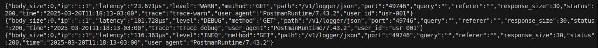

# 📂 Middleware - Quick Framework 

The **`middleware`** directory contains useful middleware implementations for the Quick Framework, making it easy to integrate common features such as authentication, compression, logging, request size limits, and UUID tracking.

### 📌 **`What are Middlewares?`**

Middlewares are functions that intercept HTTP requests before they reach the final handler. They allow:

- Validation (e.g., authentication and security policies)
- Request/response modification (e.g., GZIP compression)
- Logging and monitoring (e.g., request logging and UUID tracking)

### 📝 **Structure of a `BasicAuth`** Request
Each part of the request contains **headers and a body**:

```text
POST /login HTTP/1.1
Host: example.com
Authorization: Basic YWRtaW46MTIzNA==
Content-Type: application/json
Content-Length: 50
{
    "username": "admin",
    "password": "1234"
}
```
### 📌 **Important headers in `BasicAuth`:**
| Header | Description |
|-----------|-----------|
| `Authorization` | ends the BasicAuth credentials (Base64(username:password)). |
| `Content-Type` | Defines the format of the request body (e.g., application/json). |
| `Content-Length` | Specifies the size of the request body (optional but recommended). |


---

## 📜 Middlewares Available

🔐 BasicAuth
Provides HTTP Basic Authentication, requiring a username and password to access protected routes.

- Can be applied globally or to specific routes.
- Supports authentication via environment variables.
- Allows custom implementation if needed.

### Basic Auth environment variables

This example sets up Basic Authentication using environment variables to store the credentials securely.
the routes below are affected, to isolate the route use group to apply only to routes in the group.

```go
package main

import (
	"log"
	"os"

	"github.com/jeffotoni/quick"
	middleware "github.com/jeffotoni/quick/middleware/basicauth"
)

// Environment variables for authentication
// export USER=admin
// export PASSWORD=1234

var (
	// Retrieve the username and password from environment variables
	User     = os.Getenv("USER")
	Password = os.Getenv("PASSORD")
)

func main() {

	// Initialize a new Quick instance
	q := quick.New()

	// Apply Basic Authentication middleware
	q.Use(middleware.BasicAuth(User, Password))

	// Define a protected route
	q.Get("/protected", func(c *quick.Ctx) error {
		// Set the response content type to JSON
		c.Set("Content-Type", "application/json")

		// Return a success message
		return c.SendString("You have accessed a protected route!")
	})

	// Start the server on port 8080
	q.Listen("0.0.0.0:8080")
}
```
### 📌 cURL
```bash
$ curl -i -X GET http://localhost:8080/api/v1/users/123

You have accessed a protected route!
```
---

### Basic Authentication with Quick Middleware

This example uses the built-in BasicAuth middleware provided by Quick, offering a simple authentication setup.

```go
package main

import (
	"log"

	"github.com/jeffotoni/quick"
	middleware "github.com/jeffotoni/quick/middleware/basicauth"
)

func main() {

	//starting Quick
	q := quick.New()

	// calling middleware
	q.Use(middleware.BasicAuth("admin", "1234"))

	// everything below Use will apply the middleware
	q.Get("/protected", func(c *quick.Ctx) error {
		c.Set("Content-Type", "application/json")
		return c.SendString("You have accessed a protected route!")
	})

	// Start the server on port 8080
	q.Listen("0.0.0.0:8080")
}

```
### 📌 cURL
```bash
$ curl -i -X GET 'http://localhost:8080/protected' \
--header 'Authorization: Basic YWRtaW46MTIzNA=='

You have accessed a protected route!
```

### Basic Authentication with Quick Route Groups

This example shows how to apply Basic Authentication to a specific group of routes using Quick's Group functionality.
When we use group we can isolate the middleware, this works for any middleware in quick.

```go
package main

import (
	"log"

	"github.com/jeffotoni/quick"
	middleware "github.com/jeffotoni/quick/middleware/basicauth"
)

func main() {
	//starting Quick
	q := quick.New()

	// using group to isolate routes and middlewares
	gr := q.Group("/")

	// middleware BasicAuth
	gr.Use(middleware.BasicAuth("admin", "1234"))

	// route public
	q.Get("/v1/user", func(c *quick.Ctx) error {
		c.Set("Content-Type", "application/json")
		return c.SendString("Public quick route")
	})

	// protected route
	gr.Get("/protected", func(c *quick.Ctx) error {
		c.Set("Content-Type", "application/json")
		return c.SendString("You have accessed a protected route!")
	})

	// Start the server on port 8080
	q.Listen("0.0.0.0:8080")
}

```
### 📌 cURL
```bash
$ curl -i -X GET http://localhost:8080/v1/user

Public quick route
```


### BasicAuth Customized

This example shows a custom implementation of Basic Authentication without using any middleware. It manually verifies user credentials and applies authentication to protected routes.

In quick you are allowed to make your own custom implementation directly in q.Use(..), that is, you will be able to implement it directly if you wish.

```go
package main

import (
	"encoding/base64"
	"log"
	"net/http"
	"strings"

	"github.com/jeffotoni/quick"
)

func main() {
	//starting Quick
	q := quick.New()

	// implementing middleware directly in Use
	q.Use(func(next http.Handler) http.Handler {
		// credentials
		username := "admin"
		password := "1234"

		return http.HandlerFunc(func(w http.ResponseWriter, r *http.Request) {
			authHeader := r.Header.Get("Authorization")
			if authHeader == "" {
				http.Error(w, "Unauthorized", http.StatusUnauthorized)
				return
			}

			// Check if it starts with "Basic"
			if !strings.HasPrefix(authHeader, "Basic ") {
				http.Error(w, "Unauthorized", http.StatusUnauthorized)
				return
			}

			// Decode credentials
			payload, err := base64.StdEncoding.DecodeString(authHeader[len("Basic "):])
			if err != nil {
				http.Error(w, "Unauthorized", http.StatusUnauthorized)
				return
			}

			creds := strings.SplitN(string(payload), ":", 2)
			if len(creds) != 2 || creds[0] != username || creds[1] != password {
				http.Error(w, "Unauthorized", http.StatusUnauthorized)
				return
			}
			next.ServeHTTP(w, r)
		})
	})

	q.Get("/protected", func(c *quick.Ctx) error {
		c.Set("Content-Type", "application/json")
		return c.SendString("You have accessed a protected route!")
	})

	// Start the server on port 8080
	q.Listen("0.0.0.0:8080")

}
```
### 📌 cURL
```bash
$ curl -i -u admin:1234 -X GET http://localhost:8080/protected

You have accessed a protected route!
```
---

## 📦 Compress
The Compress Middleware in Quick provides automatic GZIP compression for HTTP responses, reducing response sizes and improving performance.

### 📌 Features:

- ✅ Automatic compression detection (Accept-Encoding: gzip)
- ✅ Transparent response compression without modifying business logic
- ✅ Bandwidth efficiency improvement
### 🚀 Middleware Implementations in Quick
The Quick framework supports multiple styles of middleware implementation for GZIP compression:

### 1️⃣ Native Quick Implementation (quick.Handler)
This is the standard and recommended approach in Quick. It follows the framework’s native middleware pattern using quick.Handler.
```go
func Gzip() func(next quick.Handler) quick.Handler {
	return func(next quick.Handler) quick.Handler {
		return quick.HandlerFunc(func(c *quick.Ctx) error {
			if !clientSupportsGzip(c) {
				// If the client does not support gzip, proceed without compression
				return next.ServeQuick(c)
			}

			// Remove Content-Length to avoid conflicts with compression
			c.Del("Content-Length")
			c.Set("Content-Encoding", "gzip")
			c.Add("Vary", "Accept-Encoding")

			// Retrieve a gzip writer from the pool
			gz := gzipWriterPool.Get().(*gzip.Writer)
			defer gzipWriterPool.Put(gz)

			gz.Reset(c.Response)
			defer gz.Close()

			// Wrap the response writer with gzipResponseWriter
			gzr := gzipResponseWriter{ResponseWriter: c.Response, writer: gz}
			c.Response = gzr

			//return next(c)
			return next.ServeQuick(c)
		})
	}
}
```
#### 📌 ✅ This is the default implementation used in Quick.

---
### 2️⃣ Alternative Syntax: quick.HandlerFunc
Quick also supports quick.HandlerFunc, which allows a function-based syntax instead of using the Handler interface.

```go
func Gzip() func(next quick.HandlerFunc) quick.HandlerFunc {
	return func(next quick.HandlerFunc) quick.HandlerFunc {
		return func(c *quick.Ctx) error {
			if !clientSupportsGzip(c) {
				// If the client does not support gzip, proceed without compression
				return next(c)
			}

			// Remove Content-Length to avoid conflicts with compression
			c.Del("Content-Length")
			c.Set("Content-Encoding", "gzip")
			c.Add("Vary", "Accept-Encoding")

			// Retrieve a gzip writer from the pool
			gz := gzipWriterPool.Get().(*gzip.Writer)
			defer gzipWriterPool.Put(gz)

			gz.Reset(c.Response)
			defer gz.Close()

			// Wrap the response writer with gzipResponseWriter
			gzr := gzipResponseWriter{ResponseWriter: c.Response, writer: gz}
			c.Response = gzr

			return next(c)
		}
	}
}
```
#### 📌 ✅ This is functionally equivalent to the default version but follows a different syntax.
---

### 3️⃣ Pure net/http Middleware Support
Quick also supports native `net/http` middleware, making it compatible with standard Go HTTP handlers.

```go
func clientSupportsGzipHttp(r *http.Request) bool {
	return strings.Contains(strings.ToLower(r.Header.Get("Accept-Encoding")), "gzip")
}

// Gzip creates a middleware to compress the response using gzip.
func Gzip() func(h http.Handler) http.Handler {
	return func(next http.Handler) http.Handler {
		return http.HandlerFunc(func(w http.ResponseWriter, r *http.Request) {
			// Checks if the client supports gzip
			if !clientSupportsGzipHttp(r) {
				next.ServeHTTP(w, r)
				return
			}

			// Remove Content-Length to avoid conflict with compressed response
			w.Header().Del("Content-Length")

			// Adjust headers to indicate that the response will be gzipped
			w.Header().Set("Content-Encoding", "gzip")
			w.Header().Add("Vary", "Accept-Encoding")

			gz := gzip.NewWriter(w)
			defer func() {
				if err := gz.Close(); err != nil {
					// If an error occurs when closing, we send 500
					http.Error(w, fmt.Sprintf("error closing gzip: %v", err), http.StatusInternalServerError)
				}
			}()

			gzr := gzipResponseWriter{writer: gz, ResponseWriter: w}
			next.ServeHTTP(gzr, r)
		})
	}
}
```
#### 📌 ✅ Useful when integrating Quick with net/http-based applications.
---

### Middleware Implementation

### 🔹 Using Quick Default Middleware (quick.Handler)
```go
package main

import (
	"log"

	"github.com/jeffotoni/quick"
	"github.com/jeffotoni/quick/middleware/compress"
)

func main() {
	q := quick.New()

	// Enable GZIP compression
	q.Use(compress.Gzip())

	// Define a compressed response route
	q.Get("/v1/compress", func(c *quick.Ctx) error {
		c.Set("Content-Type", "application/json")
		c.Set("Accept-Encoding", "gzip")

		type response struct {
			Msg     string              `json:"msg"`
			Headers map[string][]string `json:"headers"`
		}

		return c.Status(200).JSON(&response{
			Msg:     "Quick ❤️",
			Headers: c.Headers,
		})
	})

	log.Fatal(q.Listen("0.0.0.0:8080"))
}

```
---
### 🔹 Using Quick HandlerFunc Middleware (quick.HandlerFunc)
```go
package main

import (
	"log"
	"github.com/jeffotoni/quick"
	"github.com/jeffotoni/quick/middleware/compress"
)

func main() {
	q := quick.New()

	// Enable GZIP middleware using HandlerFunc version
	q.Use(compress.Gzip())

	// Define a compressed response route
	q.Get("/v1/compress", func(c *quick.Ctx) error {
		c.Set("Content-Type", "application/json")

		type response struct {
			Msg     string              `json:"msg"`
			Headers map[string][]string `json:"headers"`
		}

		return c.Status(200).JSON(&response{
			Msg:     "Quick ❤️",
			Headers: c.Headers,
		})
	})

	log.Fatal(q.Listen(":8080"))
}
```
---
### 🔹 Using Pure net/http Middleware
```go
package main

import (
	"log"
	"net/http"
	"github.com/jeffotoni/quick/middleware/compress"
)

func main() {
	mux := http.NewServeMux()

	// Route with compression enabled using the middleware
	mux.Handle("/v1/compress", compress.Gzip()(http.HandlerFunc(func(w http.ResponseWriter, r *http.Request) {
		w.Header().Set("Content-Type", "application/json")
		w.WriteHeader(http.StatusOK)
		w.Write([]byte(`{"message": "Hello, net/http with Gzip!"}`))
	})))

	log.Println("Server running at http://localhost:8080")
	log.Fatal(http.ListenAndServe(":8080", mux))
}
```
---

## 🌐 CORS (Cross-Origin Resource Sharing)
Controls how your API can be accessed from different domains.

- Restricts which domains, methods, and headers are allowed.
- Helps prevent CORS errors in browsers.
- Configurable via allowed origins, headers, and credentials.


#### 🔧 CORS Example with Quick
The example below configures CORS to allow requests from any origin, method, and header.

```go
package main

import (
	"fmt"
	"log"

	"github.com/jeffotoni/quick"
	"github.com/jeffotoni/quick/middleware/cors"
)

func main() {
	// Create a new Quick instance
	app := quick.New()

	// Apply CORS middleware to allow all origins, methods, and headers
	app.Use(cors.New(cors.Config{
		AllowedOrigins: []string{"*"}, // Allows requests from any origin
		AllowedMethods: []string{"*"}, // Allows all HTTP methods (GET, POST, PUT, DELETE, etc.)
		AllowedHeaders: []string{"*"}, // Allows all headers
	}))

	// Define a POST route for creating a user
	app.Post("/v1/user", func(c *quick.Ctx) error {
		// Set response content type as JSON
		c.Set("Content-Type", "application/json")

		// Define a struct to hold incoming JSON data
		type My struct {
			Name string `json:"name"`
			Year int    `json:"year"`
		}

		var my My

		// Parse the request body into the struct
		err := c.BodyParser(&my)
		fmt.Println("byte:", c.Body()) // Print raw request body

		if err != nil {
			// Return a 400 Bad Request if parsing fails
			return c.Status(400).SendString(err.Error())
		}

		// Print the request body as a string
		fmt.Println("String:", c.BodyString())

		// Return the parsed JSON data with a 200 OK status
		return c.Status(200).JSON(&my)
	})

	// Start the server on port 8080
	log.Fatal(app.Listen("0.0.0.0:8080"))
}

```
### 📌 Testing with cURL

#### 🔹 Making a POST request with CORS enabled

```go
$ curl --location --request POST 'http://localhost:8080/v1/user' \
--header 'Content-Type: application/json' \
--data '{"name": "John Doe", "year": 2024}'
```
---

## 📜 Logger (Request Logging)
Logs incoming HTTP requests, helping in monitoring and debugging.

- Logs request method, path, response time, and status code.
- Can be integrated with structured logging tools.
- Helps with API usage tracking and debugging.


#### 📝 Default Logging 
This example applies simple logging.

```go
package main

import (
	"github.com/jeffotoni/quick"
	"github.com/jeffotoni/quick/middleware/logger"
)

func main() {

	q := quick.New()
	q.Use(logger.New())

	q.Use(logger.New(logger.Config{
		Level: "DEGUB",
	}))

	q.Use(logger.New(logger.Config{
		Level: "WARN",
	}))

	q.Get("/v1/logger", func(c *quick.Ctx) error {
		c.Set("Content-Type", "application/json")

		return c.Status(200).JSON(quick.M{
			"msg": "Quick ❤️",
		})
	})

	q.Listen("0.0.0.0:8080")
}
```

### 📌 cURL 

Text Logging
```bash
$ curl -i -XGET http://localhost:8080/v1/logger
```
#### Console:


---

#### 📝 Structured Logging(Text Format)
This example applies logging in text format with custom log fields.

```go
package main

import (
	"github.com/jeffotoni/quick"
	"github.com/jeffotoni/quick/middleware/logger"
)

func main() {

	q := quick.New()

	q.Use(logger.New(logger.Config{
		Format:  "text",
		Pattern: "[${level}] ${time} ${ip} ${method} ${status} - ${latency} user_id=${user_id} trace=${trace}\n",
		Level:   "DEBUG",
		CustomFields: map[string]string{
			"user_id": "usr-001",
			"trace":   "trace-debug",
		},
	}))

	q.Use(logger.New(logger.Config{
		Format:  "text",
		Pattern: "[${level}] ${time} ${ip} ${method} ${status} - ${latency} user_id=${user_id} trace=${trace}\n",
		Level:   "INFO",
		CustomFields: map[string]string{
			"user_id": "usr-002",
			"trace":   "trace-info",
		},
	}))

	q.Use(logger.New(logger.Config{
		Format:  "text",
		Pattern: "[${level}] ${time} ${ip} ${method} ${status} - ${latency} user_id=${user_id} trace=${trace}\n",
		Level:   "WARN",
		CustomFields: map[string]string{
			"user_id": "usr-003",
			"trace":   "trace-warn",
		},
	}))

	// Definir rota GET para gerar logs
	q.Get("/v1/logger", func(c *quick.Ctx) error {
		c.Set("Content-Type", "application/json")

		// Retornar resposta JSON
		return c.Status(200).JSON(quick.M{
			"msg": "Quick ❤️",
		})
	})

	// Iniciar o servidor na porta 8080
	q.Listen("0.0.0.0:8080")
}

```
### 📌 cURL 

Text Logging
```bash
$ curl -i -XGET http://localhost:8080/v1/logger
```
#### Console:


---
### 🛠️ Structured Logging (Slog Format)

This example uses structured logging (slog) for better log parsing.

```go
package main

import (
	"github.com/jeffotoni/quick"
	"github.com/jeffotoni/quick/middleware/logger"
)


func main() {

	q := quick.New()

	// Apply the logger middleware with structured logging (slog)
	q.Use(logger.New(logger.Config{
		Format: "slog",
		Level:  "DEBUG",
		Pattern: "[${level}] ${ip} ${method} ${path} - ${latency} " +
			"user=${user_id} trace=${trace}\n",
		CustomFields: map[string]string{
			"user_id": "99999",
			"trace":   "trace-debug",
		},
	}))

	// Apply the logger middleware with structured logging (slog)
	q.Use(logger.New(logger.Config{
		Format: "slog",
		Level:  "INFO",
		Pattern: "[${level}] ${ip} ${method} ${path} - ${latency} " +
			"user=${user_id} trace=${trace}\n",
		CustomFields: map[string]string{
			"user_id": "99999",
			"trace":   "trace-info",
		},
	}))

	// Apply the logger middleware with structured logging (slog)
	q.Use(logger.New(logger.Config{
		Format: "slog",
		Level:  "WARN",
		Pattern: "[${level}] ${ip} ${method} ${path} - ${latency} " +
			"user=${user_id} trace=${trace}\n",
		CustomFields: map[string]string{
			"user_id": "99999",
			"trace":   "trace-warn",
		},
	}))

	// Define a test route
	q.Get("/v1/logger/slog", func(c *quick.Ctx) error {
		c.Set("Content-Type", "application/json")

		return c.Status(200).JSON(quick.M{
			"msg": "Structured logging with slog",
		})
	})

	// Start the server
	q.Listen("0.0.0.0:8080")
}

```
### 📌 cURL 

 Structured Logging (Slog)
```bash
$ curl -i -XGET http://localhost:8080/v1/logger/slog
```
#### Console:


---
### 📦 JSON Logging (Machine-Readable)

Ideal for log aggregation systems, this example logs in JSON format.

```go
package main

import (
	"github.com/jeffotoni/quick"
	"github.com/jeffotoni/quick/middleware/logger"
)

func main() {

	q := quick.New()

	// Apply logger with JSON format
	q.Use(logger.New(logger.Config{
		Format: "json",
		Level:  "INFO",
	}))

	q.Use(logger.New(logger.Config{
		Format:  "json",
		Pattern: "[${level}] ${time} ${ip} ${method} ${status} - ${latency} user_id=${user_id} trace=${trace}\n",
		Level:   "DEBUG",
		CustomFields: map[string]string{
			"user_id": "usr-001",
			"trace":   "trace-debug",
		},
	}))

	// Apply the logger middleware with structured logging (slog)
	q.Use(logger.New(logger.Config{
		Format: "json",
		Level:  "WARN",
		Pattern: "[${level}] ${ip} ${method} ${path} - ${latency} " +
			"user=${user_id} trace=${trace}\n",
		CustomFields: map[string]string{
			"user_id": "usr-001",
			"trace":   "trace-warn",
		},
	}))

	// Define an endpoint that triggers logging
	q.Get("/v1/logger/json", func(c *quick.Ctx) error {
		c.Set("Content-Type", "application/json")

		return c.Status(200).JSON(quick.M{
			"msg": "JSON logging example",
		})
	})

	// Start the server
	q.Listen("0.0.0.0:8080")
}
```
### 📌 cURL 

JSON Logging
```bash
$ curl -i -XGET http://localhost:8080/v1/logger/json
```
#### Console:



---

## 📏 Maxbody (Request Size Limiter)
Restricts the maximum request body size to prevent clients from sending excessively large payloads.

- ✅ Avoids excessive memory usage.
- ✅ Can prevent attacks such as DoS (Denial-of-Service).
- ✅ Returns a 413 Payload Too Large error when exceeded.

### 🔹 Simple Example (Using maxbody.New)
This example limits the request body size using maxbody.New(), which applies the restriction globally.

```go
package main

import (
	"log"

	"github.com/jeffotoni/quick"
	"github.com/jeffotoni/quick/middleware/maxbody"
)

func main() {
	q := quick.New()

	// Middleware to enforce a 50KB request body limit
	q.Use(maxbody.New(50000)) // 50KB

	// Define a route that accepts a request body
	q.Post("/v1/user/maxbody/any", func(c *quick.Ctx) error {
		c.Set("Content-Type", "application/json")

		log.Printf("Body received: %s", c.BodyString())
		return c.Status(200).Send(c.Body())
	})

	log.Fatal(q.Listen("0.0.0.0:8080"))
}
```
---
### 🔹 Advanced Example (Using MaxBytesReader)

This example applies MaxBytesReader for additional security by enforcing the body size limit at the request handling level.

```go
package main

import (
	"io"
	"log"
	"net/http"

	"github.com/jeffotoni/quick"
)

const maxBodySize = 1024 // 1KB

func main() {
	q := quick.New()

	// Define a route that applies MaxBytesReader for additional protection
	q.Post("/v1/user/maxbody/max", func(c *quick.Ctx) error {
		c.Set("Content-Type", "application/json")

		// Limit request body size to 1KB
		c.Request.Body = quick.MaxBytesReader(c.Response, c.Request.Body, maxBodySize)

		// Read the request body safely
		body, err := io.ReadAll(c.Request.Body)
		if err != nil {
			log.Printf("Error reading request body: %v", err)
			return c.Status(http.StatusRequestEntityTooLarge).String("Request body too large")
		}
		return c.Status(http.StatusOK).Send(body)
	})

	log.Println("Server running at http://0.0.0.0:8080")
	log.Fatal(q.Listen("0.0.0.0:8080"))
}

```
---

### 📌 Key Differences

| Implementation      | Description                                      |
|--------------------|--------------------------------------------------|
| `maxbody.New()`    | Enforces a global request body size limit.       |
| `MaxBytesReader()` | Adds an extra validation layer inside the request handler. |


---

## 🆔 MsgUUID
Assigns a UUID (Universally Unique Identifier) to each request.

- Allows easy tracking of requests in logs.
- Useful for distributed systems where tracing requests across services is required.
- Adds a unique identifier to every request automatically.


---

### ✅ Key Features  

| Feature                    | Benefit                                                     |
|----------------------------|-------------------------------------------------------------|
| 🆔 **Unique Identifier**   | Adds a UUID to each request for tracking and correlation.  |
| 🔄 **Automatic Generation** | No need for manual UUID creation, added seamlessly.       |
| 📊 **Enhanced Debugging**   | Makes log analysis easier by attaching request identifiers. |
| 🚀 **Lightweight & Fast**   | Does not impact performance, operates efficiently.         |

---

This example generates a unique request identifier with the MsgUUUID middleware.

```go
package main

import (
	"fmt"
	"log"

	"github.com/jeffotoni/quick"
	"github.com/jeffotoni/quick/middleware/msguuid"
)

func main() {
	q := quick.New()

	// Apply MsgUUID Middleware globally
	q.Use(msguuid.New())

	// Define an endpoint that responds with a UUID
	q.Get("/v1/msguuid/default", func(c *quick.Ctx) error {
		c.Set("Content-Type", "application/json")

		// Log headers to validate UUID presence
		fmt.Println("Headers:", c.Response.Header())

		// Return a 200 OK status
		return c.Status(200).JSON(nil)
	})

	log.Fatal(q.Listen("0.0.0.0:8080"))
}
```
### 📌 cURL 

```bash
$ curl -i -XGET http://localhost:8080/v1/msguuid/default
```
### 📌 Response 
```bash
"Headers":"map"[
   "Content-Type":["application/json"],
   "Msguuid":[5f49cf4d-b62e-4d81-b46e-5125b52058a6]
]
```
---
## 📩 MsgID Middleware - Quick Framework 

The `MsgID Middleware`  automatically assigns a unique identifier (MsgID) to each request. This helps with tracking, debugging, and log correlation in distributed systems.

### 🚀 Overview
- Automatically generates a unique MsgID for every incoming request.
- Ensures traceability across microservices and distributed applications.
- Adds the MsgID to both request and response headers.
- Lightweight & fast, with minimal performance overhead.

---

## ✅ Key Features

| Feature                     | Benefit                                                       |
|-----------------------------|---------------------------------------------------------------|
| 🆔 **Unique Identifier**    | Adds a MsgID to each request for tracking and correlation.   |
| 🔄 **Automatic Generation** | No need for manual MsgID creation, added seamlessly.         |
| 📊 **Enhanced Debugging**   | Makes log analysis easier by attaching request identifiers.  |
| 🚀 **Lightweight & Fast**   | Minimal performance impact, operates efficiently.            |

---
### ⚙️ How It Works
The MsgID Middleware intercepts each incoming HTTP request.
It checks if the request already has a MsgID in the headers.
If not present, it generates a new MsgID and attaches it to:
- The request headers (Msgid)
- The response headers (Msgid)

The next middleware or handler processes the request with the assigned MsgID.

Here is an example of how to use the `MsgID Middleware` with Quick:
```go
package main

import (
	"fmt"
	"log"

	"github.com/jeffotoni/quick"
	"github.com/jeffotoni/quick/middleware/msguuid"
)

func main() {
	q := quick.New()

	// Apply MsgUUID Middleware globally
	q.Use(msguuid.New())

	// Define an endpoint that responds with a UUID
	q.Get("/v1/msguuid/default", func(c *quick.Ctx) error {
		c.Set("Content-Type", "application/json")

		// Log headers to validate UUID presence
		fmt.Println("Headers:", c.Response.Header())

		// Return a 200 OK status
		return c.Status(200).JSON(nil)
	})

	log.Fatal(q.Listen("0.0.0.0:8080"))
}
```
### 📌 cURL
```bash
$ curl -i -X GET http://localhost:8080/v1/msguuid/default
```

### 📌 Response
```bash
{
  "msgid": "974562398"
}
```
---
## 🛡️ Helmet Middleware in Quick 

**Helmet** is a middleware this package provides sensible security defaults while allowing full customization.

---

### ✨ Features

- Sets common security-related HTTP headers
- Provides secure defaults
- Easily customizable via `Options` struct
- Supports skipping middleware per request

---

### 🛡️ Default Headers

By default, the middleware sets the following headers:

- X-XSS-Protection
- X-Content-Type-Options
- X-Frame-Options
- Content-Security-Policy
- Referrer-Policy
- Permissions-Policy
- Cross-Origin-Embedder-Policy
- Cross-Origin-Opener-Policy
- Cross-Origin-Resource-Policy
- Origin-Agent-Cluster
- X-DNS-Prefetch-Control
- X-Download-Options
- X-Permitted-Cross-Domain-Policies
- Strict-Transport-Security (only for HTTPS requests)
- Cache-Control

---

### 🧩 Example Usage

```go
package main

import (
	"github.com/jeffotoni/quick"
	"github.com/seuusuario/helmet"
)

func main() {
	q := quick.New()

	// Use Helmet middleware with default security headers
	q.Use(helmet.Helmet())

	// Simple route to test headers
	q.Get("/v1/user", func(c *quick.Ctx) error {

		// list all headers
		headers := make(map[string]string)
		for k, v := range c.Response.Header() {
			if len(v) > 0 {
				headers[k] = v[0]
			}
		}
		return c.Status(200).JSONIN(headers)
	})

	q.Listen("0.0.0.0:8080")
}
```
---

### 📌 cURL
```bash
$ curl -X GET 'http://localhost:8080/v1/user'
```

### 📌 Response

```bash
{
  "Cache-Control": "no-cache, no-store, must-revalidate",
  "Content-Security-Policy": "default-src 'self'",
  "Cross-Origin-Embedder-Policy": "require-corp",
  "Cross-Origin-Opener-Policy": "same-origin",
  "Cross-Origin-Resource-Policy": "same-origin",
  "Origin-Agent-Cluster": "?1",
  "Referrer-Policy": "no-referrer",
  "X-Content-Type-Options": "nosniff",
  "X-DNS-Prefetch-Control": "off",
  "X-Download-Options": "noopen",
  "X-Frame-Options": "SAMEORIGIN",
  "X-Permitted-Cross-Domain-Policies": "none",
  "X-XSS-Protection": "0"
}
```

## 🚧 **Coming soon!**
- Etag
- Pprof
- Proxy
- RequestID
- Skip
- Timeout

